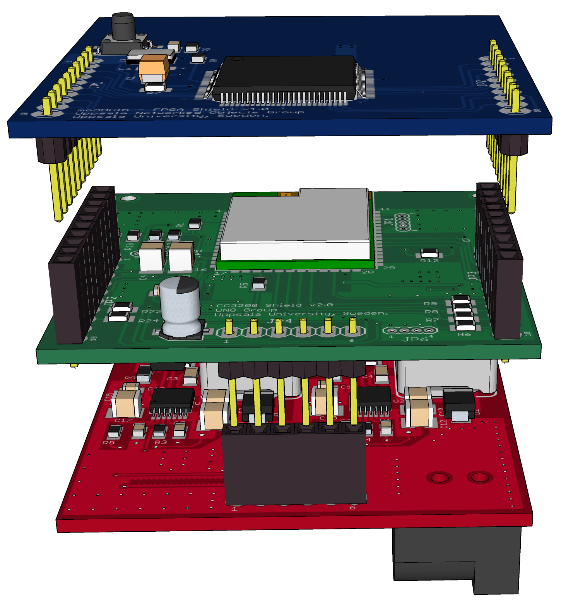
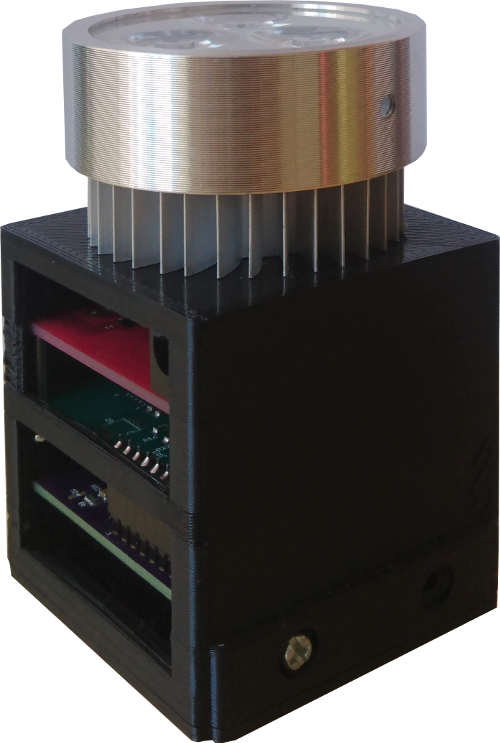

# modBulb - A modular light bulb for VLC
modBulb is an open source light bulb with a modular design that can be customized according to application’s requirements.
modBulb allows users to generate baseband signals simply through an MCU or an FPGA where more sophisticated signal processing is required. 
Moreover, modBulb offers the convenience of reprogramming the MCU and FPGA wirelessly to the users. 

modBulb uses an energy efficient switching LED driving circuitry which makes modBulb usable beyond prototyping and research applications.

## Hardware

modBulb hardware consists of three parts:

- Light source i.e. LEDs
- LED driver
- Baseband generator

There are two types of baseband generators:

- MCU baseband generator

  This baseband generator is built with TI's CC3200 SoC which is clocked at 80 MHz.

- FPGA baseband generator

  This baseband generator is built with Microsemi's AGLN060 FPGA which is clocked at 20 MHz.

Following figure shows the two baseband generators (top: FPGA baseband generator, middle MCU baseband generator) and the LED driver. 

Prototype Implementation

## Software

modBulb software undergoes a major restructuring  at the moment. However, the current software can be found in [github.com/modBulb/modBulb](https://github.com/modBulb/modBulb).

